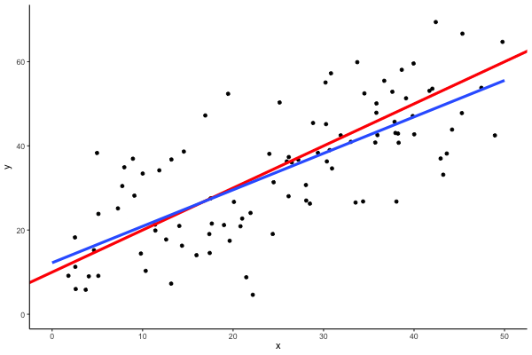

# 単回帰分析(2)

確率モデルとしての単回帰分析について理解する．

## シミュレーション

$y \sim N(x + 10, 10)$という構造を持つデータ$(x, y)$をランダムに発生させ単回帰分析を行う．

```{r, message=FALSE, warning=FALSE}
library(tidyverse)
set.seed(8931)

data <- tibble(
  x = runif(100, 0, 50),
  y = rnorm(100, x + 10, 10)
  ) 

data %>%
  ggplot(aes(x=x, y=y)) +
  geom_point() +
  geom_abline(slope= 1, intercept= 10, col = "red", lwd=1.5) +
  geom_smooth(method="lm", formula = 'y ~ x', fill=NA, lwd=1.5, fullrange=TRUE) +
  xlim(0, 50) + ylim(0, 70)+
  theme_classic()
```

赤線が$y=x+10$で，青線はデータから推定された回帰直線である．青線が完全に赤線に一致していれば正しい推定がなされたことになる．普通は若干のずれがある．

これを何回も何回も行う（ノート上は`gganimate`を使っているが，受講者諸君は手動で行うこと）．

```{r, warning=FALSE, echo=FALSE, eval=FALSE}
library(gganimate)

p <- tibble(
    x = runif(100 * 100, 0, 50),
    y = rnorm(100 * 100, x + 10, 10),
    n = 1:100 %>% map(~rep(.x, 100)) %>% as_vector()
) %>%
  ggplot(aes(x=x, y=y)) +
  geom_point() +
  geom_abline(slope= 1, intercept= 10, col = "red", lwd=1.5) +
  geom_smooth(method="lm", formula = 'y ~ x', fill=NA, lwd=1.5, fullrange=TRUE) +
  xlim(0, 50) + ylim(0, 70) +
  transition_states(n)+
  theme_classic()

animate(p, width = 600, height = 400, renderer = gifski_renderer("regression_animation.gif"))
```



試行によりデータが少しずつ変わり，回帰直線（青線）も少しずつ変わる．回帰直線$y=b_0 + b_1 x$の係数$b_1$は真の値である$1$からどれくらいずれているだろうか．サンプルサイズ100のランダムサンプリングを実施し回帰分析することを1000回繰り返して$b_1$をプロットする．

```{r message=FALSE}
b1 <- c()
for (i in 1:1000) {
  tibble(
    x = runif(100, 0, 50),
    y = rnorm(100, x + 10, 10)
  ) %>% 
  with(lm(y ~ x)) -> lm_res
  b1 <- append(b1, lm_res$coefficients["x"])
}

b1 %>% 
  as_tibble_col(column_name = "b1") %>% 
  ggplot(aes(x = b1)) +
  geom_histogram(col = "black", fill ="grey30")
```

$b_1$は真値の1を中心とした分布となる．$b_1$の平均と標準偏差は次の通り．

```{r}
mean(b1)
sd(b1)
```

## 標準線形回帰モデル

次に，一般的に確率を入れた回帰分析を導入する．

母集団上で確率変数$Y$が（確率変数ではない）変数$x$と係数$\beta_0, \beta_1$によって，平均が規定される正規分布に従っていると考える． $$\begin{align}
    Y\sim N(\beta_0 + \beta_1 x, \sigma^2)
\end{align}$$

母集団からのランダムサンプリングによって，$n$個の独立な確率変数$Y_1,Y_2,\ldots,Y_n$が得られる．確率変数$Y_1,Y_2,\ldots,Y_n$は， $$
\begin{align}
Y_i=\beta_0+\beta_1 x_i,\qquad Y_i \sim N(\beta_0+\beta_1 x_i,\sigma^2)
\end{align}
$$ もしくは，誤差確率変数$\varepsilon_i$を導入して別の表現で書けば $$
\begin{align}
Y_i=\beta_0+\beta_1 x_i +\varepsilon_i,\qquad \varepsilon_i \sim N(0,\sigma^2)\ {\rm iid}
\end{align}
$$ と表すことができる．この仮定によって，$\varepsilon$について以下のことが成り立つ．

1.  $\forall i, E(\varepsilon_i)=0$
2.  $\forall i, V(\varepsilon_i)=E(\varepsilon_i^2)=\sigma^2$
3.  $\forall i\neq j,Cov(\varepsilon_i,\varepsilon_j)=E(\varepsilon_i\varepsilon_j)=0$

以上の仮定を図解すると下図のようになる．母集団分布は赤色の正規分布であり，$x$のレベルで平均パラメータが動く（本当は，分布の赤い線は$x$のレベルに応じてぎっしり詰まっている．カマボコを上から俯瞰することを想像せよ）．ただし，分散は$x$のレベルで変わらない（分散均一性の仮定）．そして，実際の散布図データは，この母集団分布からランダムに抽出されたものである（カマボコをぶるんぶるんしたら，黒いボツボツがふぁらーと落ちてくるみたいなイメージ）．

```{r echo=FALSE}
dat <- tibble(x=runif(200, 0, 50),
              y=rnorm(200, x + 10, 10))
breaks <- c(10, 20, 30, 40, 50)
norm <- tibble()
for (t in breaks) {
  br = seq(qnorm(0.005,t + 10,10),qnorm(0.995,t + 10,10),length=200)
  tibble(x=t-dnorm(br,t + 10,10)*100,
         y=br,
         b=t) %>% 
    bind_rows(norm,.) -> norm
}
dat %>% 
  ggplot(aes(x=x, y=y)) +
  geom_point() +
  geom_path(data=norm, aes(x, y, group=b), lwd=1.0, color = "red") +
  geom_vline(xintercept=breaks, lty=2) +
  geom_abline(intercept = 10, slope = 1)+
  theme_classic()
```

## 回帰係数の標本分布

先週導入した最小二乗法によって，$\beta_0, \beta_1$は以下のように推定される．以下，推定値には「ハット」をつける．

$$
\hat{\beta}_1 = \frac{S_{xY}}{S_{xx}} = \frac{C_{xY}}{\hat{\sigma}_x^2},\quad \hat{\beta}_0 = \bar{Y} - \hat{\beta}_1 \bar{x}, \quad 
$$ ただし， $$
S_{xY}=\sum_{i=1}^n (x_i - \bar{x})(Y_i - \bar{Y})
$$ は確率変数$Y_i$によって動く確率変数である．ここから，$\hat{\beta}_1$も確率変数$Y_i$によって動く確率変数である（$\hat{\beta}_0$も）．

ここで何より重要なのは，$Y_i$が確率変数であり，サンプリングによって確率的に値が変化するものであり，それに応じて$\hat{\beta}_1$も確率変数として，サンプリングによって確率的に値が変化する，ということである．したがって，$\hat{\beta}_1$は標本分布をもつ．

途中をすっ飛ばして結論だけを言えば，$\hat{\beta}_1$は以下の分布にしたがう． $$
\begin{align}
\hat{\beta}_1 \sim N(\beta_1,\sigma^2/S_{xx})
\end{align}
$$

つまり，$\hat{\beta}_1$の標本分布は，真の値$\beta_1$を中心とした正規分布である．しかし，誤差分散$\sigma^2$は通常未知なので，残差平方和を利用して$\hat{\sigma}^2=S_e/(n-2)$と推定すると， $$
\begin{align}
t_{\hat{\beta}_1}=\frac{\hat{\beta}_1-\beta_1}{\sqrt{\hat{\sigma}^2/S_{xx}}} \sim t(n-2)
\end{align}
$$ が成り立つ．つまり，$\hat{\beta}_1$を標準化する際に$\hat{\beta}_1$の分散をデータから推定して得られた$t$統計量は自由度$n-2$の$t$分布に従う．このことを用いて検定を行う．

## 検定統計量

帰無仮説，対立仮説をそれぞれ $$
\begin{align}
H_0: \beta_1=0,\qquad H_1:\beta_1\neq 0
\end{align}
$$ とする．このとき，帰無仮説が正しいという仮定の下で検定統計量は自由度$n-2$の$t$分布に従う．つまり， $$
\begin{align}
t^*_{\hat{\beta}_1}=\frac{\hat{\beta}_1}{\sqrt{\hat{\sigma}^2/S_{xx}}} \sim t(n-2). 
\end{align}
$$ $|t^*_{\hat{\beta}_1}|\geq t_{\alpha/2}(n-2)$のとき，両側$100\alpha\%$の有意確率で帰無仮説を棄却し対立仮説を採用する．$|t^*_{\hat{\beta}_1}|< t_{\alpha/2}(n-2)$の場合帰無仮説は棄却できない．

## 検定の実際

実際にR上でどのように検定結果が報告されているか確認しよう．

```{r}
data %>%
  with(lm(y ~ x)) %>% summary()
```

データの分析結果から検定の仮定を再現する．結果出力における`x`の`Estimate`の値が$\hat{\beta}_1$に対応し，`Std. Error`の値が$\sqrt{\hat{\sigma}^2/S_{xx}}$に対応する．ゆえに，$t$値は $$
\begin{align*}
    t^*_{\hat{\beta}_1}=\frac{0.96227}{0.06952} = 13.842. 
\end{align*}
$$ となる．データサイズは$n=100$なので，自由度98の$t$分布より， $$\begin{align*}
    P(|T|>13.842) = 2* 10^{-16}
\end{align*}$$ が$p$値として得られる．

## 本日の課題

Rスクリプトを実行した結果をWordにコンパイルしたファイルをLUNA提出